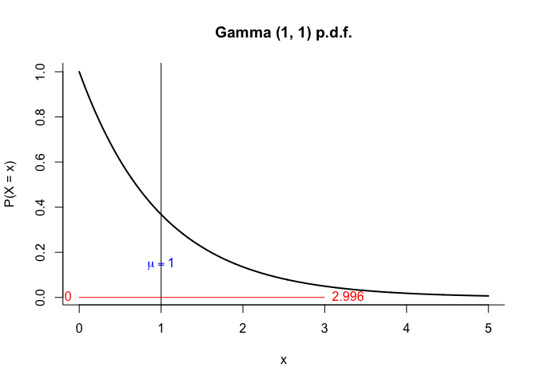
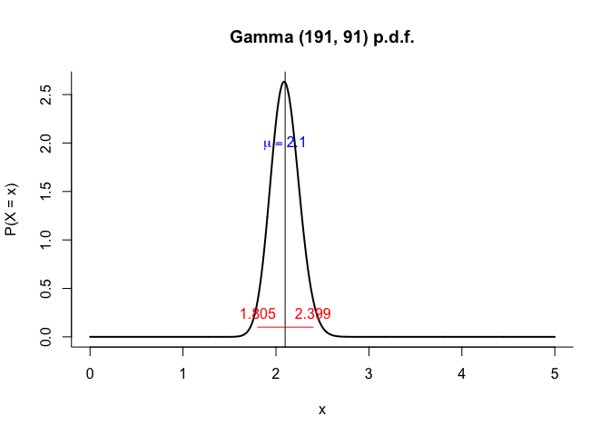

<!-- README.md is generated from README.Rmd. Please edit that file -->

# mbwadr

<!-- badges: start -->

<!-- badges: end -->

Pakiet zawiera dane oraz funkcje pomocnicze wykorzystywane podczas
laboratoriów z przedmiotu *Metody bayesowskie w analizie danych*.

## Instalacja

Pakiet mbwadr można zainstalować z [GitHub](https://github.com/) przy
pomocy kodu poniżej. Instalacja pakietów sugerowanych pozwala uniknąć
instalowania dodatkowych pakietów w trakcie zajęć.

``` r
# install.packages("pak")
pak::pak("maciejsmolka/mbwadr", dependencies = TRUE)
```

## Przykład

Poniżej przykład prostej analizy bayesowskiej.

Rozkład a priori.

``` r
library(mbwadr)
library(distributions3)
#> 
#> Attaching package: 'distributions3'
#> The following object is masked from 'package:stats':
#> 
#>     Gamma
#> The following object is masked from 'package:grDevices':
#> 
#>     pdf
library(HDInterval)

s0 <- 1
r0 <- 1
prior <- Gamma(s0, r0)
plot(prior, xlim = c(0, 5))
show_central(mean(prior), 0.15)
show_hdi(hdi(prior), pos = c(2, 4))
```



Dane.

``` r
absences
#>   n_absences n_students
#> 1          0         12
#> 2          1         20
#> 3          2         27
#> 4          3         18
#> 5          4          7
#> 6          5          3
#> 7          6          2
#> 8          7          1
```

Rozkład a posteriori dla wiarygodności poissonowskiej.

``` r
abs_total <- sum(absences$n_absences * absences$n_students)
stud_total <- sum(absences$n_students)

post <- Gamma(s0 + abs_total, r0 + stud_total)
plot(post, xlim = c(0, 5))
show_central(mean(post), 2)
show_hdi(hdi(post), 0.1)
```


